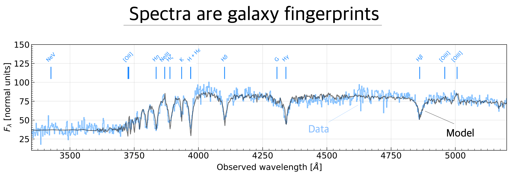

# The Rise and Fall of the First Massive Galaxies

  <!-- Full-width image row -->
  

    
  

  <!-- Regular row with text -->
  

    
Galaxies are enormous, self-gravitating systems made up of hundreds of millions of stars, glowing gas clouds, cosmic dust, planets, black holes, and a mysterious form of "dark" matter. Since the discovery of galaxies beyond our own Milky Way a century ago, astronomers have observed, classified, and measured millions of them to understand how they form and evolve over time. Among the most remarkable are the most massive galaxies—up to ten times more massive than the Milky Way. These giants were the first to turn primordial gas into stars and metals, growing at extraordinary rates before most abruptly stopped forming stars several billion years ago. Yet, despite decades of research, we still don't fully understand how they grew so rapidly—100 to 1000 times faster than the Milky Way—or why their growth suddenly ceased. Current models often require special assumptions to match what we see. This project aims to uncover new clues about the origin and evolution of these colossal early galaxies.

  

# How do we measure galaxy properties?

<!-- Full-width image row -->

  

  <!-- Regular row with text -->
  

  
To study galaxies, astronomers collect their light using giant eyes pointed at the sky—telescopes. This light, stretched across different wavelengths or colors, holds clues about the stars, gas, and dust inside each galaxy. By spreading the light into a spectrum, much like a rainbow, we can detect faint absorption features imprinted by chemical elements in the stars. The position of these features reveals the galaxy’s distance, while their depth tells us about the ages and chemical composition of the stellar populations. The relative wavelength and width of the features shows how stars are moving within the galaxy. Emission lines, on the other hand, come from glowing clouds of ionized gas and can signal ongoing star formation or the presence of energetic processes like growing super-massive black holes in their central regions.
  
  

