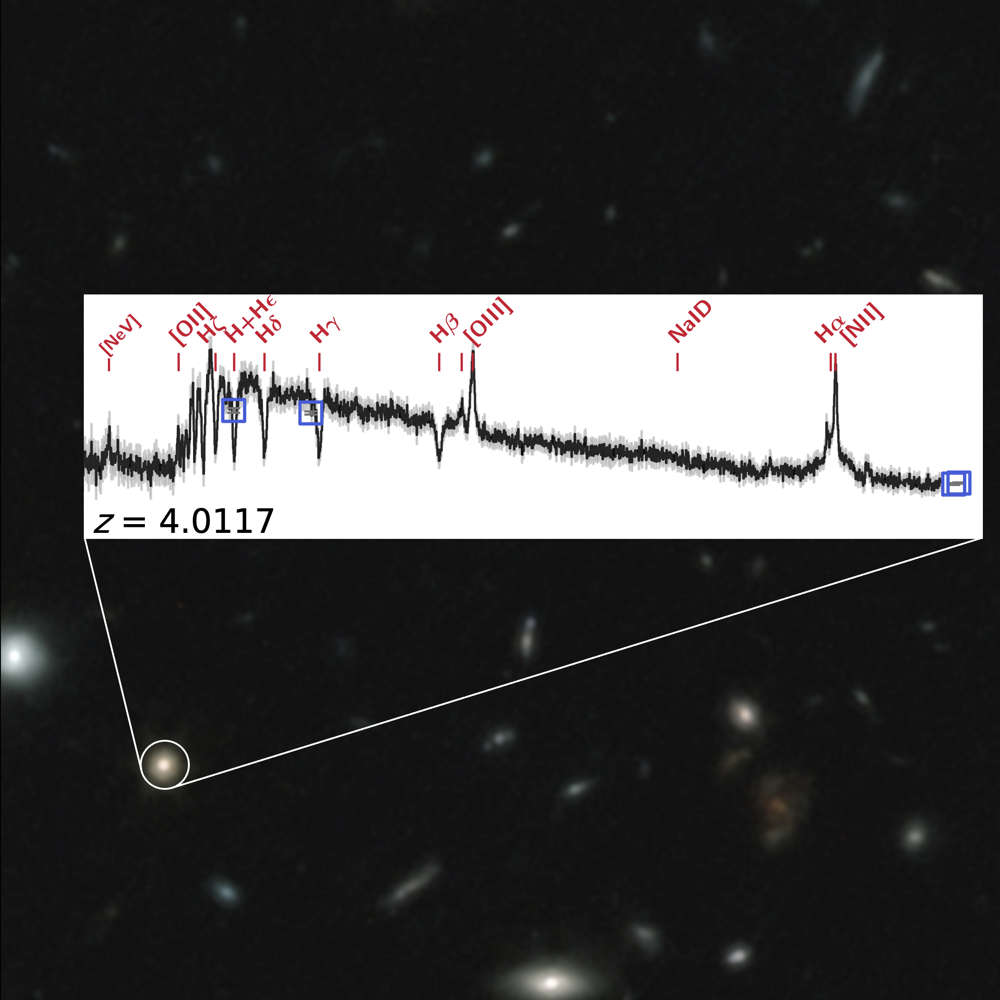

<!-- # DeepDive -->

  

    
    

      <h2>Early quiescent galaxies</h2>
      
Deep spectroscopic observations reveal faint absorption features in the stars’ atmospheres and emission lines from the remaining ionized gas within these galaxies. <b>This detailed information allows us to measure their total stellar mass, uncover chemical composition, and reconstruct their formation and growth history.</b> We can also detect pockets of ongoing star formation and identify active galactic nuclei powered by supermassive black holes. Exquisite multi-wavelength imaging enable precise measurements of galaxy sizes and structural properties.

    

  

