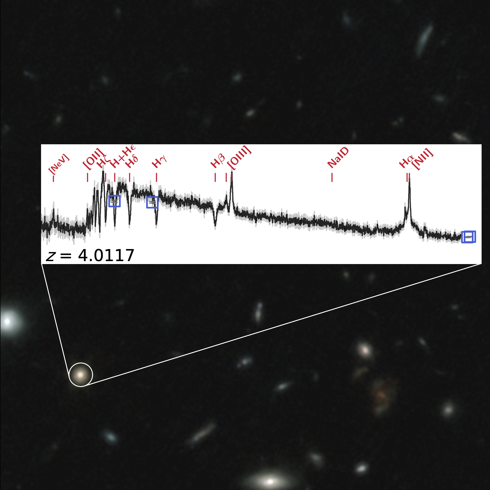
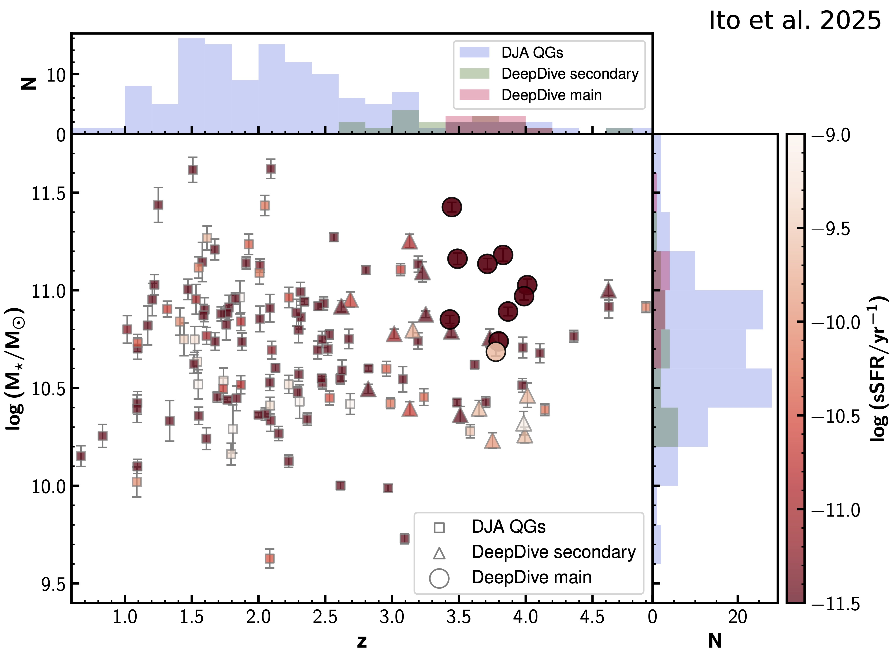

<!-- # DeepDive -->

DeepDive is a spectroscopic and imaging program with the Near-Infrared Camera (NIRCam) and Near-Infrared Spectrograph (NIRSpec) onboard the James Webb Space Telescope (JWST). It is designed to investigate the properties and underlying physics of massive quiescent galaxies at redshifts z = 3–4 — galaxies that had already ceased star formation when the universe was just ~2 billion years old. DeepDive collected NIRCam imaging and deep, medium-resolution NIRSpec spectra using the G235M/F170LP grating and filter combination for 10 primary targets in major extragalactic fields, and also confirmed several secondary quiescent galaxies at z > 3. Leveraging NIRSpec’s high multiplexing capability, the program also observed around 600 additional “filler” galaxies across 10 pointings, enabling a range of exciting new science cases in galaxy evolution.

  

    
    

      <h2>Early quiescent galaxies</h2>
      
Deep spectroscopic observations reveal faint absorption features in the stars’ atmospheres and emission lines from the remaining ionized gas within these galaxies. This detailed information allows us to measure their total stellar mass, uncover chemical composition, and reconstruct their formation and growth history. We can also detect pockets of ongoing star formation and identify active galactic nuclei powered by supermassive black holes. Complemented by exquisite multi-wavelength imaging, these data enable precise measurements of galaxy sizes and structural properties.

    

  

  
  

    <h2>Strength in numbers</h2>
    
We complemented our publicly available observations with a thorough search for massive quiescent galaxies with similar JWST spectroscopic and photometric coverage in the 
      <a href="https://dawn-cph.github.io/dja/index.html" target="_blank" rel="noopener noreferrer">Dawn JWST Archive (DJA)</a>. 
      All data have been reduced and analyzed in a homogeneous way and are included in our public data release. 
      The result is a comprehensive sample of nearly 150 systems spanning more than 4.5 billion years of cosmic history at redshifts z > 1!
    

  

  

    
    

      <h2>Star formation and metal enrichment histories</h2>
      
The absorption features embedded in the continuum spectra of massive quiescent galaxies are sensitive tracers of the age, chemical composition, and metal content of their stellar populations. By jointly modeling these spectra with multi-wavelength photometry, we can place tight and independent constraints on when these galaxies formed their stars, how rapidly they assembled their mass, and how abruptly star formation was halted.

    

  

 

  
  

    <h2>Interstellar Medium and Outflows</h2>
    

      The relative strength and width of rest-frame emission lines provide insight into the ionized interstellar medium—its kinematics, physical conditions, and power sources. In addition, specific absorption features from elements such as sodium, magnesium, and iron trace the neutral gas phase that remains in early quenched galaxies. These spectral diagnostics reveal residual star formation and the presence—and degree of activity—of growing supermassive black holes. In turn, they help us understand how these processes shape the properties and motions of the surrounding gas, often driving powerful outflows that may expel material from galaxies altogether.
    

  

  

    
    

      <h2>Environment</h2>
      

    

  

